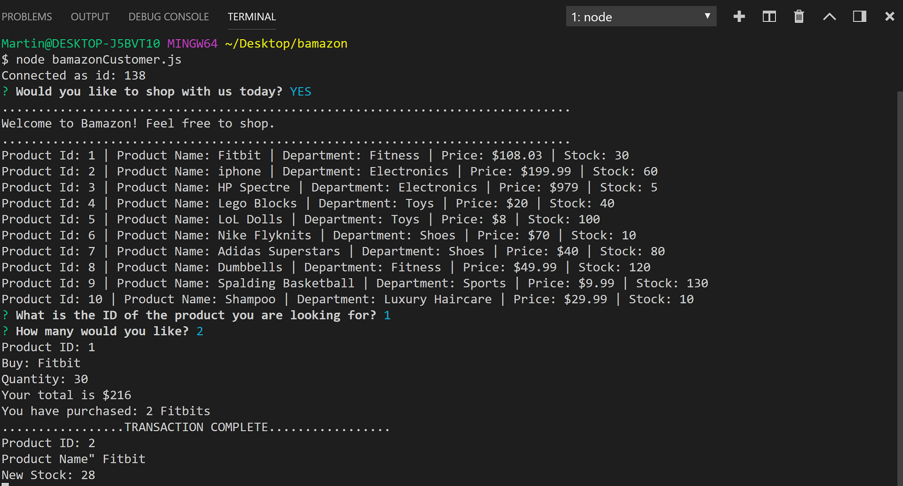

# Bamazon App
## Function:
An e-commerce Node application that takes in user/customer orders from the command line

## Step-by-step Guide:

1. When user hits command line 'node bamazonCustomer.js' , it prompts the user to shop or not. Product catalog shows up as well.
2. Prompts user number of units to be purchased.
3. Shows user product info such as ID, Quantity, Total Cost, Name of products purchased.
4. Shows information regarding complete purchase and updates stock.

- If no, greets customers and quits shopping

- If invalid ID is put, prompts user 'Please enter valid ID'

- If user requests item more than the available stock, prompts user 'insufficient stock' 

## Technoligies Used
1. Node
2. MYSQL 
3. NPM Packages
- MYSQl
- Inquirer 
